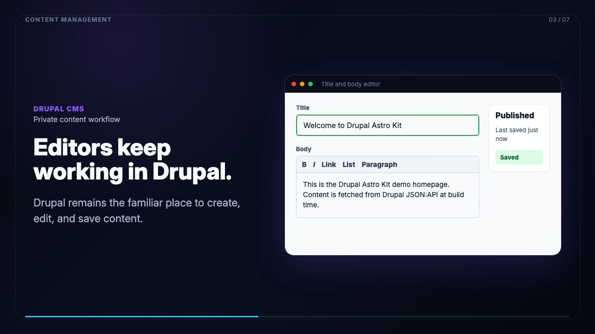

# Drupal Astro Kit

## Full CMS editing. Static Astro delivery.

Use Drupal locally to model, manage, and edit structured content. Build the public website with Astro and deploy only static files.

**No production database. No PHP runtime. No publicly accessible CMS.**

Drupal handles content management. Astro handles presentation. Cloudflare Pages serves the finished site.

[](https://github.com/user-attachments/assets/4c216dec-b949-4614-b04e-5607763b7766)

**[▶ Watch the walkthrough: edit in Drupal, build with Astro, and deploy a static website.](https://github.com/user-attachments/assets/4c216dec-b949-4614-b04e-5607763b7766)**

> **Project status: Alpha / Developer Preview**
> The complete workflow runs locally on macOS with DDEV. Linux should work, while Windows and broader environment coverage have not yet been validated.

## Why this exists

Static Astro sites are fast, inexpensive to host, and operationally simple. But content often becomes harder to model and manage as a site grows beyond Markdown files and basic editing interfaces.

Drupal Astro Kit keeps the useful part of a mature CMS without carrying its runtime into production:

* Build structured content types, fields, media, menus, and editorial workflows in Drupal
* Fetch published content through JSON:API during development and builds
* Generate routes from Drupal URL aliases
* Render the public website with Astro
* Deploy pre-rendered HTML to static hosting or a CDN
* Turn Drupal off when you are not editing or building

## Architecture

```text
Drupal running locally
        │
        │ JSON:API + Linkset
        ▼
    Astro build
        │
        ▼
  Static HTML, CSS, and JavaScript
        │
        ▼
 Cloudflare Pages or another static host
```

The deployed website does not connect to Drupal and does not require Drupal to remain online.

## What you get

* **One-command bootstrap** that creates and connects the Drupal and Astro projects
* **Local Drupal 11 CMS** managed through DDEV
* **Static Astro frontend** with no production CMS dependency
* **Structured content and menus** exposed through JSON:API and Linkset
* **Drupal alias-based routing** mapped to Astro pages
* **Optional Media image support** with build-time image URLs
* **Local build and deployment workflow** for Cloudflare Pages
* **Framework flexibility** through Astro islands when client-side interactivity is needed

## Who this is for

Drupal Astro Kit is intended for developers who want:

* More structured content management than Markdown provides
* Drupal’s content modeling without hosting Drupal publicly
* An Astro frontend that owns the design and rendering
* Static hosting with minimal production infrastructure
* A local-first publishing workflow where rebuilding is an intentional release step

It is probably not the right fit when editors need an always-available hosted CMS, content must publish automatically without a developer-controlled build, or server-side rendering is required.


---

## Table of Contents

- Features
- Prerequisites
- Quick Start
- Local Development Flow
- Build & Deployment
- Publishing Workflow
- Architecture
- Project Structure
- Known Limitations
- Troubleshooting

---

## Features

### Static-first (default)

This kit assumes:

- Drupal lives locally
- Astro fetches content at build time only
- Cloudflare Pages serves a static site
- No SSR dependency on Drupal in production

### One-command bootstrap

The interactive CLI:

- Creates a Drupal 11 project under DDEV
- Installs JSON:API, CORS configuration, and a starter content type
- Enables Drupal Linkset and seeds starter `main` + `footer` menus
- Can optionally install Media-based image handling with JSON:API image style URLs
- Creates an Astro project
- Wires Drupal → Astro environment variables
- Generates example routes that map Drupal aliases into Astro pages

### Modern frontend for Drupal

Astro replaces Twig entirely.

Use React/Svelte/Solid/Vue islands if you want interactivity.

### Clean separation

- Drupal → content
- Astro → presentation
- Cloudflare Pages → hosting

---

## Prerequisites

Tool | Version | Install
--- | --- | ---
Node.js | 20+ | brew install node@20
DDEV | Latest | brew install ddev/ddev/ddev
Docker | Latest | brew install --cask docker
Composer | Latest | brew install composer
Cloudflare Account | Free | <https://dash.cloudflare.com> (deployment only)

Important: In static mode, Drupal does not need to be hosted anywhere. It only needs to run locally when building the Astro site.

---

## Quick Start

1. Clone this kit and initialize your project

```bash
git clone https://github.com/rovo79/Drupal-Astro-Kit.git my-project
cd my-project
git remote remove origin
```

Add your own GitHub repo:

```bash
git remote add origin https://github.com/your-user/my-project.git
```

2. Run the setup

```bash
chmod +x setup.sh
./setup.sh
```

This will:

- Create drupal-backend/ in DDEV
- Create astro-frontend/
- Configure .env
- Map Drupal’s JSON:API into Astro
- Generate working SSG routes: `src/pages/index.astro` + `src/pages/[...slug].astro`

3. Starter content and menus are provisioned automatically

The setup flow applies Drupal recipes and seeds starter navigation:

- Pages: `/home`, `/about`, `/contact`
- `main` menu: `Home`, `About`, `Contact`
- `footer` menu: `About`, `Contact`

It also validates the required endpoint:

- `http://<project>.ddev.site/system/menu/main/linkset`

Optional reseed command (safe to rerun):

```bash
./scripts/seed-content.sh
```

This ensures published Basic pages and menu links exist and keeps Linkset enabled.

Optional setup capability:

- Media images: adds a Drupal Image media type, a `field_hero_image` Media reference on starter page models, and JSON:API image style URLs for Astro build-time rendering

4. Launch local development

```bash
# Start Drupal
cd drupal-backend && ddev start && ddev launch

# Start Astro
# When setup finishes, you are asked “Start Astro dev now in this terminal?”
# Say yes to reuse this terminal, or decline and run `cd astro-frontend && npm run dev` later.
```

You now have:

- Drupal: <http://my-project.ddev.site>
- Astro: <http://localhost:4321>

---

## Local Development Flow

You maintain content in Drupal locally.

Astro reads Drupal during `npm run dev` and `npm run build`:

- Page content and aliases from JSON:API
- Optional page hero images from Media references and JSON:API image style URLs
- Navigation menus from Linkset (`/system/menu/<menu>/linkset`)

The deployed static site does not fetch Drupal at runtime.

```text
Drupal (local)
    ↓ JSON:API + Linkset
Astro build
    ↓
Static HTML in dist/
    ↓
Cloudflare Pages Hosting
```

### Content updates

- Editing an existing Basic page only requires saving in Drupal and refreshing the browser while `npm run dev` is running; the dev server pulls the latest JSON:API data on navigation.
- Editing a Drupal menu label only requires saving in Drupal and refreshing the browser while `npm run dev` is running; the dev server fetches fresh Linkset menu data per request.
- Creating a new route or alias (new page or a different path) needs a fresh build (`npm run build`) so Astro can regenerate the static HTML that includes the new route.

For the full publishing workflow and why rebuild-to-publish is intentional, see [docs/publishing.md](docs/publishing.md).

There is no Drupal runtime dependency in production.

### Homepage routing

Drupal decides which page is the “front page” via path aliases. Many sites keep the homepage at `/home`, while the public URL you care about is `/`.

Set `HOMEPAGE_ALIAS` in your `.env` file (default: `/home`). The Astro homepage route (`src/pages/index.astro`) will render:

- a Drupal page with alias `/` if one exists, otherwise
- the Drupal page matching `HOMEPAGE_ALIAS`

That means your homepage content is authored once in Drupal (usually at `/home`) and appears at both `/` and `/home` in Astro.

### Landing pages and feeds

For this starter kit, Astro should usually compose landing pages directly from Drupal JSON:API entity queries, not from Drupal Views.

Use direct JSON:API queries when:

- Astro owns the page layout and section ordering
- The data maps directly to content types or other entities
- You want explicit frontend-side normalization and predictable contracts

Use a View-backed JSON endpoint only when Drupal should own the feed logic, such as editor-managed curated feeds or unusually complex shared queries.

Search is a separate concern: direct JSON:API filtering is fine for simple browse flows, but faceted search usually deserves a dedicated Search API-style endpoint later.

---

## Build & Deployment

### Prerequisites for Deployment

1. **Cloudflare Account**: Sign up at [dash.cloudflare.com](https://dash.cloudflare.com)
2. **API Token**: Create one with "Cloudflare Pages" permissions
3. **Account ID**: Found in your Cloudflare dashboard URL

Add these to your `.env` file:

```bash
CLOUDFLARE_API_TOKEN=your-api-token-here
CLOUDFLARE_ACCOUNT_ID=your-account-id-here
```

### Building the Static Site

Before building, make sure your local Drupal is running:

```bash
cd drupal-backend && ddev start
```

Then build the Astro site:

```bash
cd astro-frontend
npm run build
```

This will:

1. Connect to your local Drupal's JSON:API
2. Fetch all published pages and menu Linksets
3. Generate static HTML in `dist/`

### Deploying to Cloudflare Pages

**Option 1: Using the deploy script (recommended)**

```bash
./scripts/deploy-frontend.sh
```

This builds and deploys in one command.

**Option 2: Manual deployment with Wrangler**

```bash
cd astro-frontend
npm run build
npx wrangler pages deploy ./dist --project-name=my-project
```

**Option 3: Cloudflare Dashboard (drag-and-drop)**

1. Go to Cloudflare Dashboard → Pages
2. Click "Create a project" → "Direct Upload"
3. Drag the `astro-frontend/dist` folder

### First-Time Deployment

On first deploy, you may need to create the Pages project:

```bash
npx wrangler pages project create my-project
```

Then run the deploy script again.

### Updating Your Site

To update content:

1. Edit pages in Drupal at `http://my-project.ddev.site/admin/content`
2. Run `./scripts/deploy-frontend.sh` to rebuild and deploy

Your changes will be live in seconds!

---

## Architecture

Drupal responsibilities

- WYSIWYG content
- Fields, media, menus
- JSON:API output (content + aliases)
- Linkset output (menu trees)
- URL aliases (Pathauto)

Astro responsibilities

- Fetch pages from Drupal JSON:API and menus from Drupal Linkset at build time
- Build static HTML from templates
- Handle routing using Drupal aliases
- Add interactivity using islands if desired

Cloudflare responsibilities

- Serve static site globally
- Serve static output via Pages CDN

---

## Example Drupal → Astro Route

The setup script generates something like:

Files:
- `src/pages/index.astro`
- `src/pages/[...slug].astro`

```astro
---
import { getAllPages, aliasToSlug } from '../lib/drupal';

export async function getStaticPaths() {
  const pages = await getAllPages();

  return pages
    .filter((page) => page.path?.alias && page.path.alias !== '/')
    .map((page) => ({
      params: { slug: aliasToSlug(page.path!.alias)! },
      props: { page },
    }));
}

const { page } = Astro.props;
---

<h1>{page.title}</h1>
<article set:html={page.body?.processed ?? ''} />
```

This means:

- Astro builds /about, /company/team, etc. based on Drupal aliases
- No fetch at runtime

---

## Project Structure

> **Note:** `drupal-backend/` and `astro-frontend/` are created by `./setup.sh` and are gitignored. They do not exist in a fresh clone.

```plaintext
my-project/
├── astro-frontend/         # Astro SSG frontend (gitignored — created by setup.sh)
│   ├── src/
│   ├── astro.config.mjs
│   └── package.json
├── drupal-backend/         # Drupal 11 CMS under DDEV (gitignored — created by setup.sh)
│   ├── .ddev/
│   └── web/
├── setup/                  # Interactive Ink-based installer
│   ├── cli.js
│   └── ui.js
├── templates/              # Source templates copied into astro-frontend/ during setup
├── scripts/                # Utility scripts (deploy, seed content)
├── setup.sh                # Bootstrap script
├── .env                    # Created during setup (gitignored)
└── README.md               # You are here
```

---

## Known Limitations

- **Local-only Drupal**: Drupal runs in DDEV on your machine. There is no hosted CMS option in V1. Every build requires your local Drupal to be running.
- **No automated CI/CD out of the box**: CI for this local-first project requires a Drupal instance reachable from the CI runner, which is not included by default.
- **No test suite**: The setup flow is validated manually. There are no automated unit or integration tests.
- **macOS-first**: Primarily tested on macOS with DDEV. Linux should work. Windows/WSL2 is untested.
- **Static-only**: Astro runs in `output: 'static'` mode. There is no server-side rendering, no Cloudflare Workers runtime, no edge rendering. This is by design.
- **New routes require a rebuild**: Adding a new page or alias in Drupal requires running `npm run build` again — the Astro dev server does not pick up new routes dynamically.
- **Single content type in base recipe**: The starter kit provisions Basic Pages only. Additional content types require custom Drupal recipes.

---

## Troubleshooting

Astro cannot reach Drupal during build

Ensure DDEV is running:

```bash
cd drupal-backend
ddev start
```

Visit <http://my-project.ddev.site/jsonapi> to confirm.

Cloudflare build fails

Cloudflare cannot reach your local Drupal. You must build locally, then deploy static output.

Aliases not appearing in JSON:API

This kit expects published **Basic pages** to have a **URL alias** (e.g. `/about`). The Astro routes are generated from `path.alias` returned by JSON:API (not from `/node/123` internal URLs).

---

## Contributing

Contributions are welcome! Please read [CONTRIBUTING.md](CONTRIBUTING.md) before submitting issues or pull requests. Use the GitHub issue templates for bug reports and setup feedback.

---

## License

The tooling and templates in this repository are MIT licensed — see [LICENSE](LICENSE).

Drupal recipe packages under `setup/drupal-recipes/` follow **GPL-2.0-or-later**, as required by the Drupal ecosystem. See each recipe's `composer.json` for details.
